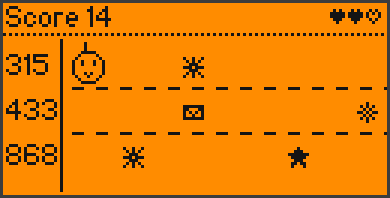

<div align="center">

# 📡 Signal Pet for Flipper Zero

**A virtual pet that lives on the radio signals around you.**
Hunt Sub-GHz remotes, NFC cards, 125 kHz tags, infrared remotes and
iButton keys with your Flipper, feed them to your pet and watch it level
up, evolve and learn new moves.


[](https://github.com/King-Kong-341/Flipper-Zero-Games_Signal_Pet/actions/workflows/build.yml)

 

</div>

---

## 📁 What's in here?

| Folder | What it is | Who needs it |
|---|---|---|
| 📦 **[`Signal Pet/`](Signal%20Pet/)** | the finished app: **`signal_pet.fap`** | everyone — this is the file for your Flipper |
| 🧩 [`source/`](source/) | the C source code | only if you want to build or change the app |
| 🖼 [`images/`](images/) | the pictures on this page | — |

## 🎯 What is this?

A collecting game with a pet. You start with an egg — warm it up and it
hatches. Your pet eats **radio signals**: take your Flipper on a hunt, press a
car key or a doorbell, hold a bank card or a door fob to the back, point a TV
remote at it. Every new signal fills the **Signal Dex**, lands in the
**Logbook** and gives XP. The pet grows from a tiny *Bitling* into one of
**6 adult forms** — which one depends on what it ate most. On the way it
unlocks **10 new moves** and new looks, up to level 99.

No hunger, no health bars — your pet can't die. Just hunt, collect and level up.

## 📥 Installation

1. Open the folder **[`Signal Pet`](Signal%20Pet/)** and click
   **`signal_pet.fap`** → **Download** (the ⬇ button on the right).
   It's also on the [Releases page](https://github.com/King-Kong-341/Flipper-Zero-Games_Signal_Pet/releases).
2. Open [qFlipper](https://flipperzero.one/update) on your computer and
   connect your Flipper via USB.
3. In qFlipper's **File Manager**, copy the file to **`SD Card/apps/Games/`**.
4. On the Flipper: **Menu → Apps → Games → Signal Pet**. Have fun!

> Made for the **official Flipper firmware 1.x**. If the app doesn't start
> on your firmware, build it yourself (see the end of this page).

## 🎮 How to play

| Key | In the room | In menus |
|---|---|---|
| ◀ ▶ | pick an icon in the bottom bar | move / change a value |
| **OK** | open it | select |
| ▲ | pet your pet | move |
| ▼ | your pet tells you something | move |
| **Back** | say goodbye and exit | go back |
| hold **Back** | quit from anywhere | |

The bottom bar: **Hunt · Play · Clean · Sleep · Signal Dex · Logbook · Stats · Settings**

### 📡 Hunting — what your pet eats

| Source | Try this | Where on the Flipper |
|---|---|---|
| **Sub-GHz** | car keys, garage gates, doorbells, remotes | listens on **all** Sub-GHz bands (300–928 MHz) |
| **NFC** | bank, transit, hotel and access cards, phones | hold it to the **back** |
| **RFID 125 kHz** | door fobs, office badges, pet microchips | hold it to the **back** |
| **Infrared** | any TV or AC remote | aim at the **top** and press a button |
| **iButton** | intercom keys (Dallas, Cyfral, Metakom) | touch the iButton contacts |

- **Every signal type has its own XP value** — based on how often you meet
  it in real life. Protocols built into millions of devices give little,
  ones that hardly anybody uses give a lot. The value decides the stars:

  | Stars | Examples (XP for a new species) |
  |---|---|
  | ★ Common | Raw IR (AC remotes) 7 · NEC TV remotes 9 · bank cards 12 · NTAG stickers 14 · Princeton 433 MHz remotes 17 · EM4100 door fobs 18 |
  | ★★ Uncommon | CAME gates 23 · HID badges 26 · GateTX 31 · MIFARE DESFire 31 · Hörmann garages 38 |
  | ★★★ Rare | NEC42 remotes 46 · KeeLoq car keys 47 · DS1990 iButtons 54 · Somfy blinds 57 · FDX-B pet chips 63 · Nice FloR-S 71 |
  | ★★★★ Epic | Security+ 2.0 garages 79 · Star Line car alarms 93 · Noralsy tags 93 · FeliCa cards 96 · KingGates 97 |
  | ★★★★★ Legendary | Scher-Khan 108 · Hollarm 111 · KIA Seed 117 · Cyfral 147 · Metakom 158 |

- **Sub-GHz frequency bonus:** 433.92 MHz is the busiest frequency (no bonus).
  Other 433/434 MHz channels give +12 %, 315 MHz +18 %, 868 MHz +24 %, odd
  frequencies like 300, 390, 418 or 915 MHz up to **+52 %**.
- A **new species** is a signal type you never had. Another remote or card
  of a type you know gives about a quarter of its value, catching the same
  one again later gives a little, within 20 minutes it's "old news".
- **Sub-GHz "All" band:** the radio has one receiver, so it sniffs the signal
  strength of all 54 standard frequencies in a fast loop (about 0.2 s for
  all of them) and jumps onto any channel that lights up to decode it.
  Tip: hold the button of your remote for 1–2 seconds. You can also lock
  onto 433, 868 or 315 MHz with ◀ ▶.
- **External CC1101 board** (e.g. the Rabbit-Labs *Flux Capacitor*) on the
  GPIO header? Signal Pet finds it automatically ("Board: CC1101") and uses
  it for Sub-GHz hunts — the first time gives a gadget bonus.

### 🌱 Growing

- XP comes mostly from **new and rare signals**. The mini games, cleaning
  and sleeping give a little extra — games at most 5 XP per round and
  30 XP per day, because they can be replayed forever.
- **Level 5:** teen. **Level 10:** adult — *Wavern* (Sub-GHz), *Tapkin* (NFC),
  *Coilbit* (RFID), *Irix* (IR), *Keybo* (iButton) or *Omnix* (a balanced diet).
- **New moves** at levels 3, 5, 8, 10, 15, 20, 30, 45, 70 and 99: Radar Ping,
  Dance, Spin, Juggle, Moonwalk, Backflip, Power Up, Levitate, Teleport and
  Legend Glow. High levels also bring orbiting signal orbs, an aura, a halo,
  wings, a sparkle trail, shockwave landings and lightning.
- **Clean:** digested signals leave static on the floor. With a lot of
  static around, catches give only half XP — sweep it up for XP.
- **Sleep:** put your pet to bed; when it wakes up it gets dream XP.

## ✨ Features

- 🐣 **Egg hatching**, naming with your own **keyboard** (or a random name)
- 🎬 **Animations everywhere:** CRT-style boot with a logo built from flying
  pixels, catch cinematic (lock-on, the signal flies into the mouth, chomp,
  result card), level-up and evolution scenes, three screen transitions
- 🌗 **Day & night** from the real clock: sun and clouds, moon and stars,
  lights off when your pet sleeps
- 📖 **Signal Dex** with every signal type your firmware can decode, **Logbook** of the last 40
  catches with time and ID, **16 badges**, stats
- 🎮 **3 mini games:** *Byte Catch* (catch falling packets, dodge static),
  *Tune In* (match your wave to the target on an oscilloscope) and
  *Freq Hopper* (hop between three radio bands, grab packets, dodge noise)
- ⭐ **Every signal type has its own XP value** (Common to Legendary) plus a
  bonus for rare Sub-GHz frequencies — rare signals are worth the hunt
- 🔊 **Sound, vibration & LED** — every source has its own LED colour
- ⚙️ **Settings** with a one-line explanation for every option
- 💾 Everything is saved on the SD card

## 🖼 Screens

| | | |
|:-:|:-:|:-:|
|  |  |  |
| The room | Sub-GHz hunt (all bands) | A rare catch with frequency bonus |
|  |  |  |
| NFC hunt | Logbook | Signal Dex |
|  |  |  |
| A level 99 legend | Name keyboard | Hatching the egg |
|  |  |  |
| Mini games | Freq Hopper | Tune In |
|  | | |
| External board found | | |

## 🛠 Build it yourself

Only needed if the ready-made file doesn't work on your firmware or you want
to change something. You need [Python 3](https://www.python.org/downloads/):

```bash
pip install ufbt
cd source
python -m ufbt            # -> source/dist/signal_pet.fap
python -m ufbt launch     # or: build, install and start it on a connected Flipper
```

Signal Pet only **receives** — it never transmits anything.

---

Made by **King-Kong-341**. MIT licensed, see [LICENSE](LICENSE).
